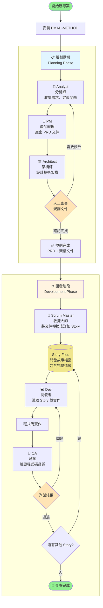

# BMAD-METHOD 工作流程

## 流程圖

## 流程說明

### 📋 規劃階段（Planning Phase）

這個階段由三個專業代理協作，產出完整的專案規劃文件：

- **👤 Analyst（分析師）**：收集需求、定義問題
- **📱 PM（產品經理）**：整理成 PRD（產品需求文件）
- **🏗️ Architect（架構師）**：設計技術架構

完成後需要人工審查，確認無誤後產出 PRD + 架構文件。

### ⚙️ 開發階段（Development Phase）

規劃完成後進入開發流程：

- **📝 Scrum Master（敏捷大師）**：將規劃文件轉換成詳細的 Story 檔案
- **💻 Dev（開發者）**：讀取 Story 並進行程式碼實作
- **🧪 QA（測試）**：驗證程式碼品質

測試通過後繼續下一個 Story，直到所有 Story 完成。

### 核心特色

**規劃階段**透過多個代理協作產出前後一致的完整規劃。

**開發階段**的 Story 檔案系統讓每個開發任務都有完整情境，開發者不會迷失方向。
