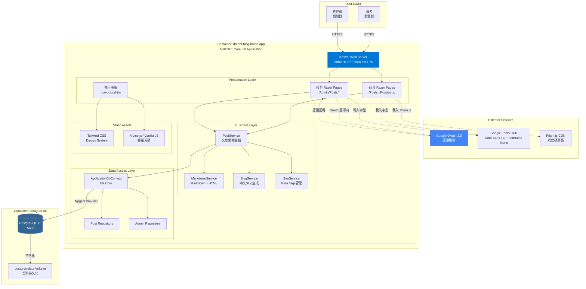
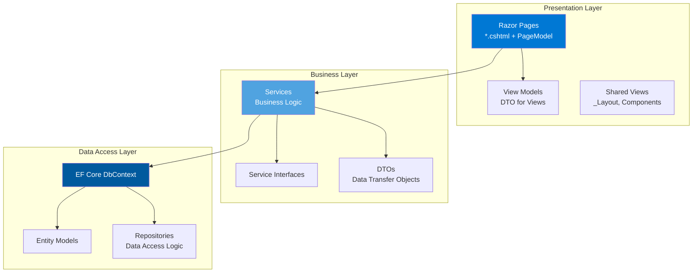
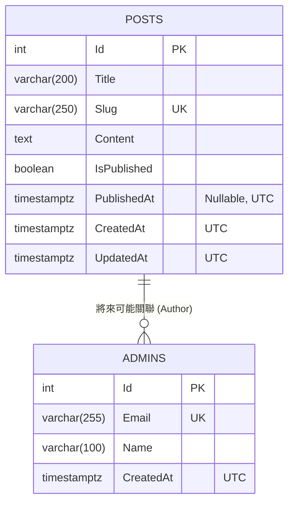
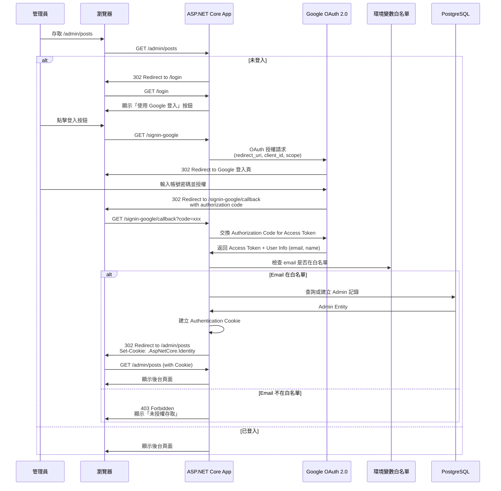
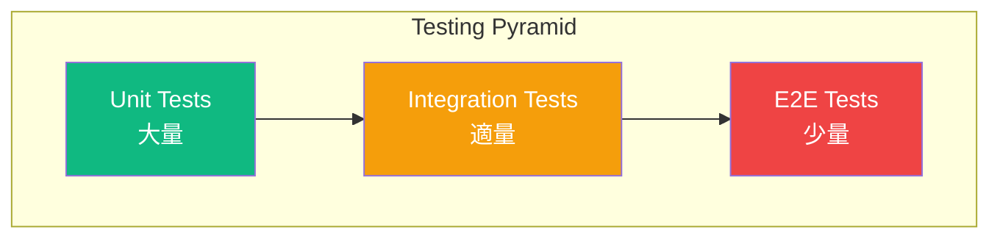
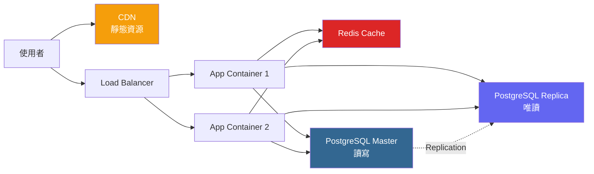

# .NET 個人部落格系統 Architecture Document

## Document Information

| Field | Value |
|-------|-------|
| **Version** | v1.0 |
| **Date** | 2025-10-30 |
| **Author** | Winston (Architect) |
| **Status** | Draft |
| **Related Documents** | `docs/prd.md`, `docs/brief.md` |

---

## Table of Contents

1. [System Architecture Overview](#system-architecture-overview)
2. [Application Architecture](#application-architecture)
3. [Data Architecture](#data-architecture)
4. [Integration Architecture](#integration-architecture)
5. [Security Architecture](#security-architecture)
6. [Deployment Architecture](#deployment-architecture)
7. [Testing Strategy](#testing-strategy)
8. [Performance & Scalability](#performance--scalability)
9. [Code Standards & Conventions](#code-standards--conventions)
10. [Appendices](#appendices)

---

## System Architecture Overview

### High-Level Architecture

本系統採用 **Monolithic Architecture（單體架構）** 設計，以 ASP.NET Core 8.0 Razor Pages 為核心，整合前後端功能於同一應用程式中。這種架構適合 MVP 階段的個人部落格，簡化開發與部署流程。



### Technology Stack

#### Frontend Technologies

| Component | Technology | Version | Purpose |
|-----------|-----------|---------|---------|
| **UI Framework** | ASP.NET Core Razor Pages | 8.0 | 伺服器端渲染（SSR） |
| **CSS Framework** | Tailwind CSS | 3.x | Utility-first CSS，實作設計系統 |
| **JavaScript** | Alpine.js / Vanilla JS | 3.x | 輕量前端互動（下拉選單、模態框） |
| **Markdown Editor** | EasyMDE | 2.x | 後台 Markdown 編輯器（SimpleMDE fork） |
| **Code Highlighting** | Prism.js | 1.x | 前台程式碼語法高亮 |
| **Fonts** | Google Fonts | - | Noto Sans TC, JetBrains Mono |

#### Backend Technologies

| Component | Technology | Version | Purpose |
|-----------|-----------|---------|---------|
| **Runtime** | .NET | 8.0 LTS | 應用程式執行環境 |
| **Web Framework** | ASP.NET Core | 8.0 | Web 應用程式框架 |
| **ORM** | Entity Framework Core | 8.0 | 資料庫 ORM |
| **Database Provider** | Npgsql EF Core Provider | 8.x | PostgreSQL 連線 |
| **Markdown Processor** | Markdig | 0.37.x | Markdown → HTML 轉換 |
| **Authentication** | Google OAuth 2.0 | - | 管理員認證 |

#### Database & Storage

| Component | Technology | Version | Purpose |
|-----------|-----------|---------|---------|
| **Database** | PostgreSQL | 15.x | 關聯式資料庫 |
| **ORM** | Entity Framework Core | 8.0 | 資料存取層 |

#### Infrastructure & DevOps

| Component | Technology | Version | Purpose |
|-----------|-----------|---------|---------|
| **Container Runtime** | Docker / Podman | Latest | 容器化開發與部署 |
| **Container Orchestration** | docker-compose / podman-compose | Latest | 本地服務編排 |
| **Base Image (Build)** | mcr.microsoft.com/dotnet/sdk | 8.0 | 建置環境（Debian） |
| **Base Image (Runtime)** | mcr.microsoft.com/dotnet/aspnet | 8.0 | 執行環境（Debian） |
| **Web Server** | Kestrel | Built-in | ASP.NET Core 內建 Web Server |

#### Testing & Quality

| Component | Technology | Version | Purpose |
|-----------|-----------|---------|---------|
| **Test Framework** | xUnit | 2.x | 單元測試與整合測試 |
| **Assertion Library** | FluentAssertions | 6.x | 測試斷言 |
| **Code Analysis** | Roslyn Analyzers | Built-in | 靜態程式碼分析 |

### Architectural Decisions

#### ADR-001: Monolithic Architecture (Single Container)

**Decision:** 採用單體架構，前後端整合於同一 ASP.NET Core 應用程式中。

**Rationale:**
- **簡化開發：** 單一 codebase，減少跨服務通訊複雜度
- **部署簡單：** 單一容器即可運行整個應用
- **效能優越：** 無 API 呼叫開銷，Razor Pages SSR 效率高
- **SEO 友善：** 完整 HTML 由伺服器生成，搜尋引擎完美支援
- **適合 MVP：** 個人部落格流量有限，不需要微服務的複雜性

**Trade-offs:**
- ⚠️ 前後端耦合較緊，未來若需分離需重構
- ⚠️ 水平擴展時需複製整個應用（但個人部落格不太需要）
- ✅ 可在 Phase 2 重構為 SPA + API 架構（如需要）

#### ADR-002: ASP.NET Core Razor Pages (Not Blazor)

**Decision:** 選擇 Razor Pages 而非 Blazor Server 或 Blazor WebAssembly。

**Rationale:**
- **SEO 優先：** Razor Pages 伺服器端渲染完整 HTML，搜尋引擎完美支援
- **成熟穩定：** 自 2017 年推出，社群資源豐富，問題少
- **學習曲線平緩：** 類似傳統 MVC，易於理解與維護
- **效能卓越：** 無客戶端框架開銷，初次載入快速
- **適合內容型網站：** 部落格主要是內容展示，不需要複雜的客戶端互動

**Trade-offs:**
- ⚠️ 互動性不如 Blazor（但部落格不需要）
- ⚠️ 頁面切換需完整 Page Reload（可接受）
- ✅ Tailwind CSS + Alpine.js 可補充輕量互動需求

#### ADR-003: PostgreSQL (Not SQLite)

**Decision:** 使用 PostgreSQL 作為資料庫，開發與生產環境一致。

**Rationale:**
- **功能完整：** 成熟的關聯式資料庫，支援進階功能（Full-Text Search, JSON）
- **容器化簡單：** 官方 Docker 映像，與應用容器並行運作
- **環境一致性：** 避免開發用 SQLite、生產用 PostgreSQL 的遷移問題
- **擴展性佳：** 未來若需要分類、標籤、搜尋，PostgreSQL 能力充足
- **生產就緒：** 無需遷移，直接部署

**Trade-offs:**
- ⚠️ 開發環境需運行 PostgreSQL 容器（已透過 docker-compose 解決）
- ⚠️ 映像檔稍大（相對於 SQLite），但可接受
- ✅ 長期維護成本低於遷移成本

#### ADR-004: Debian Container Base Image (Not Alpine)

**Decision:** 使用 Debian 基底映像，開發與生產環境一致。

**Rationale:**
- **穩定性優先：** Debian 是最穩定的 Linux 發行版之一
- **相容性好：** 幾乎所有套件都有 Debian 版本，問題少
- **除錯容易：** 標準 Linux 工具完整，開發體驗佳
- **Microsoft 官方推薦：** .NET 官方映像預設使用 Debian

**Trade-offs:**
- ⚠️ 映像檔較大（230-250MB vs Alpine 的 100MB）
- ✅ 映像檔大小對個人部落格影響小（頻寬、儲存成本低）
- ✅ 未來若需要可輕鬆改為 Alpine（Dockerfile 只需改一行）

#### ADR-005: Tailwind CSS (Not Bootstrap)

**Decision:** 使用 Tailwind CSS 實作設計系統。

**Rationale:**
- **Utility-First：** 快速建構自訂設計，不受預設樣式限制
- **Design Tokens 原生支援：** 透過 `tailwind.config.js` 定義顏色、字型、間距
- **一致性保證：** 使用預定義的 Classes，避免 CSS 混亂
- **生產優化：** Purge 功能移除未使用的 CSS，檔案極小
- **現代工具鏈：** PostCSS 整合，JIT 模式編譯快速

**Trade-offs:**
- ⚠️ HTML 中 Class 名稱較長（`bg-primary text-white px-4 py-2 rounded`）
- ✅ 換取完全自訂設計的能力，符合「設計優先」理念

---

## Application Architecture

### Layered Architecture

本應用採用 **三層架構（Three-Tier Architecture）**：



### Project Structure

```
dotnet-blog-bmad/
├── Pages/                          # Presentation Layer - Razor Pages
│   ├── Index.cshtml                # 首頁
│   ├── Index.cshtml.cs             # 首頁 Page Model
│   ├── Posts/                      # 前台文章頁面
│   │   ├── Index.cshtml            # 文章列表頁
│   │   ├── Index.cshtml.cs
│   │   ├── Post.cshtml             # 文章內容頁 (/posts/{slug})
│   │   └── Post.cshtml.cs
│   ├── Admin/                      # 後台管理頁面
│   │   ├── Index.cshtml            # 後台首頁
│   │   ├── Index.cshtml.cs
│   │   └── Posts/
│   │       ├── Index.cshtml        # 文章管理列表
│   │       ├── Index.cshtml.cs
│   │       ├── Create.cshtml       # 新增文章
│   │       ├── Create.cshtml.cs
│   │       ├── Edit.cshtml         # 編輯文章
│   │       └── Edit.cshtml.cs
│   ├── Auth/                       # 認證相關頁面
│   │   ├── Login.cshtml            # 登入頁
│   │   ├── Login.cshtml.cs
│   │   ├── Logout.cshtml           # 登出處理
│   │   └── Logout.cshtml.cs
│   ├── Error.cshtml                # 錯誤頁面
│   ├── Error.cshtml.cs
│   └── Shared/                     # 共用 Views
│       ├── _Layout.cshtml          # 全站佈局
│       ├── _LoginPartial.cshtml    # 登入狀態 Partial View
│       └── Components/             # View Components
│           └── Pagination/
│               ├── Default.cshtml
│               └── PaginationViewComponent.cs
│
├── Services/                       # Business Layer - 業務邏輯
│   ├── Interfaces/                 # Service Interfaces
│   │   ├── IPostService.cs
│   │   ├── IMarkdownService.cs
│   │   ├── ISlugService.cs
│   │   └── ISeoService.cs
│   ├── PostService.cs              # 文章業務邏輯
│   ├── MarkdownService.cs          # Markdown 處理
│   ├── SlugService.cs              # Slug 生成邏輯
│   └── SeoService.cs               # SEO Meta Tags 管理
│
├── Data/                           # Data Access Layer
│   ├── ApplicationDbContext.cs     # EF Core DbContext
│   ├── Entities/                   # Entity Models
│   │   ├── Post.cs                 # 文章 Entity
│   │   └── Admin.cs                # 管理員 Entity
│   ├── Configurations/             # EF Core Fluent API Configurations
│   │   ├── PostConfiguration.cs
│   │   └── AdminConfiguration.cs
│   └── Migrations/                 # EF Core Migrations
│       └── (Generated by EF Tools)
│
├── Models/                         # DTOs & View Models
│   ├── DTOs/                       # Data Transfer Objects
│   │   ├── PostDto.cs
│   │   └── PostListItemDto.cs
│   └── ViewModels/                 # View Models for Pages
│       ├── PostListViewModel.cs
│       ├── PostDetailViewModel.cs
│       └── PostEditViewModel.cs
│
├── wwwroot/                        # Static Assets
│   ├── css/
│   │   ├── site.css                # Tailwind @tailwind directives
│   │   └── output.css              # Compiled Tailwind CSS (生產)
│   ├── js/
│   │   ├── site.js                 # 自訂 JavaScript
│   │   └── alpine.min.js           # Alpine.js (可選 CDN)
│   ├── lib/                        # Third-party Libraries
│   │   ├── easymde/                # EasyMDE (Markdown Editor)
│   │   └── prismjs/                # Prism.js (Code Highlighting)
│   └── images/                     # 靜態圖片（預設 Logo, 預設 OG Image）
│       └── default-og-image.png
│
├── Extensions/                     # Extension Methods
│   ├── ServiceCollectionExtensions.cs  # DI 註冊
│   └── StringExtensions.cs             # 字串處理輔助
│
├── Middleware/                     # Custom Middleware
│   └── (保留未來使用)
│
├── appsettings.json                # 應用程式設定
├── appsettings.Development.json    # 開發環境設定
├── appsettings.Production.json     # 生產環境設定
├── Program.cs                      # 應用程式進入點
├── Dockerfile                      # 容器建置設定
├── docker-compose.yml              # 本地開發服務編排
├── .dockerignore                   # Docker 忽略檔案
├── .gitignore                      # Git 忽略檔案
├── .editorconfig                   # 編輯器設定
├── tailwind.config.js              # Tailwind CSS 設定
├── postcss.config.js               # PostCSS 設定
├── package.json                    # Node.js 套件（Tailwind CSS）
└── README.md                       # 專案說明文件
```

### Component Responsibilities

#### Presentation Layer (Pages/)

**職責：**
- 處理 HTTP 請求與回應
- 渲染 HTML 頁面
- 表單驗證（客戶端與伺服器端）
- 呼叫 Business Layer Services

**設計原則：**
- Page Model 應保持輕量，避免複雜業務邏輯
- 資料處理委派給 Services
- 使用 View Models 傳遞資料給 Views

**範例（文章列表頁）：**

```csharp
// Pages/Posts/Index.cshtml.cs
public class IndexModel : PageModel
{
    private readonly IPostService _postService;

    public IndexModel(IPostService postService)
    {
        _postService = postService;
    }

    public PostListViewModel ViewModel { get; set; }

    public async Task<IActionResult> OnGetAsync(int page = 1)
    {
        const int pageSize = 10;

        var posts = await _postService.GetPublishedPostsAsync(page, pageSize);
        var totalPosts = await _postService.GetPublishedPostCountAsync();

        ViewModel = new PostListViewModel
        {
            Posts = posts,
            CurrentPage = page,
            TotalPages = (int)Math.Ceiling(totalPosts / (double)pageSize)
        };

        return Page();
    }
}
```

#### Business Layer (Services/)

**職責：**
- 實作核心業務邏輯
- 資料驗證與轉換
- 呼叫 Data Access Layer
- 協調多個 Entities 的操作

**設計原則：**
- 每個 Service 單一職責（SRP）
- 透過 Interfaces 定義契約，支援 DI
- 無狀態設計（Stateless），可安全地註冊為 Scoped

**範例（PostService）：**

```csharp
// Services/Interfaces/IPostService.cs
public interface IPostService
{
    Task<IEnumerable<PostListItemDto>> GetPublishedPostsAsync(int page, int pageSize);
    Task<int> GetPublishedPostCountAsync();
    Task<PostDetailDto?> GetPostBySlugAsync(string slug);
    Task<int> CreatePostAsync(PostEditViewModel model);
    Task UpdatePostAsync(int id, PostEditViewModel model);
    Task DeletePostAsync(int id);
}

// Services/PostService.cs
public class PostService : IPostService
{
    private readonly ApplicationDbContext _context;
    private readonly IMarkdownService _markdownService;
    private readonly ISlugService _slugService;

    public PostService(
        ApplicationDbContext context,
        IMarkdownService markdownService,
        ISlugService slugService)
    {
        _context = context;
        _markdownService = markdownService;
        _slugService = slugService;
    }

    public async Task<IEnumerable<PostListItemDto>> GetPublishedPostsAsync(
        int page, int pageSize)
    {
        return await _context.Posts
            .Where(p => p.IsPublished)
            .OrderByDescending(p => p.PublishedAt)
            .Skip((page - 1) * pageSize)
            .Take(pageSize)
            .Select(p => new PostListItemDto
            {
                Id = p.Id,
                Title = p.Title,
                Slug = p.Slug,
                Summary = p.Content.Substring(0, Math.Min(150, p.Content.Length)),
                PublishedAt = p.PublishedAt.Value
            })
            .ToListAsync();
    }

    // ... 其他方法實作
}
```

#### Data Access Layer (Data/)

**職責：**
- 定義 Entity Models
- EF Core DbContext 配置
- 資料庫 Migrations
- 資料存取邏輯（透過 DbContext 或 Repositories）

**設計原則：**
- Entity Models 使用 Fluent API 配置（`Configurations/`）
- 避免在 Entity Models 中放業務邏輯
- 使用 Async 方法提升效能

**範例（Post Entity）：**

```csharp
// Data/Entities/Post.cs
public class Post
{
    public int Id { get; set; }
    public string Title { get; set; } = string.Empty;
    public string Slug { get; set; } = string.Empty;
    public string Content { get; set; } = string.Empty; // Markdown
    public bool IsPublished { get; set; }
    public DateTime? PublishedAt { get; set; }
    public DateTime CreatedAt { get; set; }
    public DateTime UpdatedAt { get; set; }
}

// Data/Configurations/PostConfiguration.cs
public class PostConfiguration : IEntityTypeConfiguration<Post>
{
    public void Configure(EntityTypeBuilder<Post> builder)
    {
        builder.ToTable("Posts");

        builder.HasKey(p => p.Id);

        builder.Property(p => p.Title)
            .IsRequired()
            .HasMaxLength(200);

        builder.Property(p => p.Slug)
            .IsRequired()
            .HasMaxLength(250);

        builder.HasIndex(p => p.Slug)
            .IsUnique();

        builder.Property(p => p.Content)
            .IsRequired();

        builder.HasIndex(p => p.PublishedAt);

        builder.Property(p => p.CreatedAt)
            .IsRequired();

        builder.Property(p => p.UpdatedAt)
            .IsRequired();
    }
}
```

### Dependency Injection Configuration

所有 Services 透過 ASP.NET Core 的 DI 容器註冊：

```csharp
// Extensions/ServiceCollectionExtensions.cs
public static class ServiceCollectionExtensions
{
    public static IServiceCollection AddApplicationServices(
        this IServiceCollection services)
    {
        // Business Layer Services
        services.AddScoped<IPostService, PostService>();
        services.AddSingleton<IMarkdownService, MarkdownService>();
        services.AddSingleton<ISlugService, SlugService>();
        services.AddScoped<ISeoService, SeoService>();

        return services;
    }
}

// Program.cs
builder.Services.AddApplicationServices();
```

**Service Lifetimes:**
- **Singleton:** `MarkdownService`, `SlugService`（無狀態工具類）
- **Scoped:** `PostService`, `SeoService`（依賴 DbContext，每個 Request 一個實例）
- **Transient:** 不使用（避免效能問題）

---

## Data Architecture

### Database Schema

#### Entity Relationship Diagram



**說明：**
- MVP 階段 `Posts` 與 `Admins` 為獨立表，無外鍵關聯
- 未來 Phase 2 可加入 `AuthorId` 欄位支援多作者

#### Posts Table

| Column | Type | Constraints | Description |
|--------|------|-------------|-------------|
| `Id` | `SERIAL` | `PRIMARY KEY` | 文章 ID（自動遞增） |
| `Title` | `VARCHAR(200)` | `NOT NULL` | 文章標題 |
| `Slug` | `VARCHAR(250)` | `NOT NULL`, `UNIQUE` | URL Slug（支援中文） |
| `Content` | `TEXT` | `NOT NULL` | Markdown 內容 |
| `IsPublished` | `BOOLEAN` | `NOT NULL`, `DEFAULT FALSE` | 發布狀態 |
| `PublishedAt` | `TIMESTAMPTZ` | `NULLABLE` | 發布時間（UTC） |
| `CreatedAt` | `TIMESTAMPTZ` | `NOT NULL` | 建立時間（UTC） |
| `UpdatedAt` | `TIMESTAMPTZ` | `NOT NULL` | 更新時間（UTC） |

**Indexes:**
- `PRIMARY KEY` on `Id`
- `UNIQUE INDEX` on `Slug`
- `INDEX` on `PublishedAt` (for sorting & filtering)
- `INDEX` on `IsPublished, PublishedAt` (composite index for list queries)

**SQL DDL:**

```sql
CREATE TABLE "Posts" (
    "Id" SERIAL PRIMARY KEY,
    "Title" VARCHAR(200) NOT NULL,
    "Slug" VARCHAR(250) NOT NULL,
    "Content" TEXT NOT NULL,
    "IsPublished" BOOLEAN NOT NULL DEFAULT FALSE,
    "PublishedAt" TIMESTAMPTZ NULL,
    "CreatedAt" TIMESTAMPTZ NOT NULL DEFAULT NOW(),
    "UpdatedAt" TIMESTAMPTZ NOT NULL DEFAULT NOW()
);

CREATE UNIQUE INDEX "IX_Posts_Slug" ON "Posts" ("Slug");
CREATE INDEX "IX_Posts_PublishedAt" ON "Posts" ("PublishedAt");
CREATE INDEX "IX_Posts_IsPublished_PublishedAt" ON "Posts" ("IsPublished", "PublishedAt");
```

#### Admins Table

| Column | Type | Constraints | Description |
|--------|------|-------------|-------------|
| `Id` | `SERIAL` | `PRIMARY KEY` | 管理員 ID（自動遞增） |
| `Email` | `VARCHAR(255)` | `NOT NULL`, `UNIQUE` | Google 帳號 Email |
| `Name` | `VARCHAR(100)` | `NOT NULL` | 管理員名稱 |
| `CreatedAt` | `TIMESTAMPTZ` | `NOT NULL` | 建立時間（UTC） |

**Indexes:**
- `PRIMARY KEY` on `Id`
- `UNIQUE INDEX` on `Email`

**SQL DDL:**

```sql
CREATE TABLE "Admins" (
    "Id" SERIAL PRIMARY KEY,
    "Email" VARCHAR(255) NOT NULL,
    "Name" VARCHAR(100) NOT NULL,
    "CreatedAt" TIMESTAMPTZ NOT NULL DEFAULT NOW()
);

CREATE UNIQUE INDEX "IX_Admins_Email" ON "Admins" ("Email");
```

### Entity Framework Core Configuration

#### ApplicationDbContext

```csharp
// Data/ApplicationDbContext.cs
public class ApplicationDbContext : DbContext
{
    public ApplicationDbContext(DbContextOptions<ApplicationDbContext> options)
        : base(options)
    {
    }

    public DbSet<Post> Posts => Set<Post>();
    public DbSet<Admin> Admins => Set<Admin>();

    protected override void OnModelCreating(ModelBuilder modelBuilder)
    {
        base.OnModelCreating(modelBuilder);

        // Apply Fluent API Configurations
        modelBuilder.ApplyConfiguration(new PostConfiguration());
        modelBuilder.ApplyConfiguration(new AdminConfiguration());
    }

    public override Task<int> SaveChangesAsync(
        CancellationToken cancellationToken = default)
    {
        // Auto-update UpdatedAt timestamp
        var entries = ChangeTracker.Entries<Post>()
            .Where(e => e.State == EntityState.Modified);

        foreach (var entry in entries)
        {
            entry.Entity.UpdatedAt = DateTime.UtcNow;
        }

        return base.SaveChangesAsync(cancellationToken);
    }
}
```

#### Connection String Management

```csharp
// Program.cs
var connectionString = builder.Configuration.GetConnectionString("DefaultConnection")
    ?? throw new InvalidOperationException(
        "Connection string 'DefaultConnection' not found.");

builder.Services.AddDbContext<ApplicationDbContext>(options =>
    options.UseNpgsql(connectionString));
```

**appsettings.json:**

```json
{
  "ConnectionStrings": {
    "DefaultConnection": "Host=${POSTGRES_HOST};Database=${POSTGRES_DB};Username=${POSTGRES_USER};Password=${POSTGRES_PASSWORD}"
  }
}
```

**環境變數注入（docker-compose.yml）：**

```yaml
environment:
  - POSTGRES_HOST=db
  - POSTGRES_DB=dotnet_blog
  - POSTGRES_USER=bloguser
  - POSTGRES_PASSWORD=${POSTGRES_PASSWORD}
```

### Database Migrations Strategy

**Migration 管理原則：**
1. 所有 Schema 變更透過 EF Core Migrations 管理
2. Migration 名稱使用描述性命名（`AddSlugIndexToPosts`）
3. 本地開發使用 `dotnet ef database update`
4. 生產環境在容器啟動時自動執行 Migrations

**建立 Migration:**

```bash
dotnet ef migrations add InitialCreate
dotnet ef database update
```

**自動執行 Migrations（Program.cs）：**

```csharp
// Program.cs (在 app.Run() 之前)
using (var scope = app.Services.CreateScope())
{
    var dbContext = scope.ServiceProvider.GetRequiredService<ApplicationDbContext>();
    await dbContext.Database.MigrateAsync();
}
```

### Data Seeding (Optional)

開發環境可選擇性 Seed 測試資料：

```csharp
// Data/ApplicationDbContextSeed.cs
public static class ApplicationDbContextSeed
{
    public static async Task SeedAsync(ApplicationDbContext context)
    {
        if (!await context.Admins.AnyAsync())
        {
            context.Admins.Add(new Admin
            {
                Email = "admin@example.com",
                Name = "System Admin",
                CreatedAt = DateTime.UtcNow
            });

            await context.SaveChangesAsync();
        }

        if (!await context.Posts.AnyAsync())
        {
            context.Posts.AddRange(
                new Post
                {
                    Title = "歡迎使用 .NET 個人部落格",
                    Slug = "歡迎使用-net-個人部落格",
                    Content = "# 歡迎\n\n這是第一篇測試文章。",
                    IsPublished = true,
                    PublishedAt = DateTime.UtcNow,
                    CreatedAt = DateTime.UtcNow,
                    UpdatedAt = DateTime.UtcNow
                }
            );

            await context.SaveChangesAsync();
        }
    }
}
```

---

## Integration Architecture

### Google OAuth 2.0 Authentication Flow



### Google OAuth Configuration

**Program.cs:**

```csharp
builder.Services
    .AddAuthentication(options =>
    {
        options.DefaultScheme = CookieAuthenticationDefaults.AuthenticationScheme;
        options.DefaultChallengeScheme = GoogleDefaults.AuthenticationScheme;
    })
    .AddCookie(options =>
    {
        options.LoginPath = "/login";
        options.LogoutPath = "/logout";
        options.AccessDeniedPath = "/access-denied";
        options.ExpireTimeSpan = TimeSpan.FromDays(30);
        options.SlidingExpiration = true;
    })
    .AddGoogle(options =>
    {
        options.ClientId = builder.Configuration["Authentication:Google:ClientId"]
            ?? throw new InvalidOperationException("Google ClientId not found");
        options.ClientSecret = builder.Configuration["Authentication:Google:ClientSecret"]
            ?? throw new InvalidOperationException("Google ClientSecret not found");

        options.Scope.Add("profile");
        options.Scope.Add("email");

        options.Events.OnCreatingTicket = async context =>
        {
            var email = context.Principal?.FindFirstValue(ClaimTypes.Email);
            if (string.IsNullOrEmpty(email))
            {
                context.Fail("Unable to retrieve email from Google");
                return;
            }

            // 檢查白名單
            var allowedEmails = builder.Configuration["Authentication:AllowedAdminEmails"]
                ?.Split(',', StringSplitOptions.RemoveEmptyEntries)
                ?? Array.Empty<string>();

            if (!allowedEmails.Contains(email, StringComparer.OrdinalIgnoreCase))
            {
                context.Fail("Email not authorized");
                return;
            }

            // 確保 Admin 存在於資料庫
            var dbContext = context.HttpContext.RequestServices
                .GetRequiredService<ApplicationDbContext>();

            var admin = await dbContext.Admins
                .FirstOrDefaultAsync(a => a.Email == email);

            if (admin == null)
            {
                admin = new Admin
                {
                    Email = email,
                    Name = context.Principal.FindFirstValue(ClaimTypes.Name) ?? email,
                    CreatedAt = DateTime.UtcNow
                };
                dbContext.Admins.Add(admin);
                await dbContext.SaveChangesAsync();
            }
        };
    });

builder.Services.AddAuthorization(options =>
{
    options.AddPolicy("AdminOnly", policy =>
        policy.RequireAuthenticatedUser());
});
```

**appsettings.json:**

```json
{
  "Authentication": {
    "Google": {
      "ClientId": "${GOOGLE_CLIENT_ID}",
      "ClientSecret": "${GOOGLE_CLIENT_SECRET}"
    },
    "AllowedAdminEmails": "${ALLOWED_ADMIN_EMAILS}"
  }
}
```

**.env (Local Development):**

```env
GOOGLE_CLIENT_ID=your-client-id.apps.googleusercontent.com
GOOGLE_CLIENT_SECRET=your-client-secret
ALLOWED_ADMIN_EMAILS=admin@example.com,another-admin@example.com
```

### Authorization Policy

後台頁面套用 Authorization：

```csharp
// Pages/Admin/Posts/Index.cshtml.cs
[Authorize(Policy = "AdminOnly")]
public class IndexModel : PageModel
{
    // ...
}
```

**或全域套用（Program.cs）：**

```csharp
builder.Services.AddRazorPages(options =>
{
    options.Conventions.AuthorizeFolder("/Admin", "AdminOnly");
});
```

### External Service Integrations

#### Google Fonts

**載入方式：** CDN

```html
<!-- Pages/Shared/_Layout.cshtml -->
<head>
    <link rel="preconnect" href="https://fonts.googleapis.com">
    <link rel="preconnect" href="https://fonts.gstatic.com" crossorigin>
    <link href="https://fonts.googleapis.com/css2?family=Noto+Sans+TC:wght@400;500;600;700&family=JetBrains+Mono:wght@400;500;700&display=swap" rel="stylesheet">
</head>
```

#### Prism.js (Code Highlighting)

**載入方式：** CDN 或本地

```html
<!-- Pages/Posts/Post.cshtml (文章內容頁) -->
<link rel="stylesheet" href="https://cdn.jsdelivr.net/npm/prismjs@1/themes/prism-tomorrow.min.css">
<script src="https://cdn.jsdelivr.net/npm/prismjs@1/prism.min.js"></script>
<script src="https://cdn.jsdelivr.net/npm/prismjs@1/components/prism-csharp.min.js"></script>
<script src="https://cdn.jsdelivr.net/npm/prismjs@1/components/prism-javascript.min.js"></script>
<!-- 其他語言... -->
```

#### EasyMDE (Markdown Editor)

**載入方式：** NPM 安裝或 CDN

```html
<!-- Pages/Admin/Posts/Create.cshtml & Edit.cshtml -->
<link rel="stylesheet" href="https://cdn.jsdelivr.net/npm/easymde@2/dist/easymde.min.css">
<script src="https://cdn.jsdelivr.net/npm/easymde@2/dist/easymde.min.js"></script>

<script>
var easyMDE = new EasyMDE({
    element: document.getElementById('content-editor'),
    spellChecker: false,
    autosave: {
        enabled: true,
        uniqueId: "post-content",
        delay: 1000,
    }
});
</script>
```

---

## Security Architecture

### Security Principles

1. **Defense in Depth（深度防禦）：** 多層次安全機制
2. **Least Privilege（最小權限）：** 只授予必要的存取權限
3. **Secure by Default（預設安全）：** 安全配置為預設選項
4. **Fail Securely（安全失敗）：** 錯誤時拒絕存取而非允許

### HTTPS Enforcement

**強制 HTTPS（Program.cs）：**

```csharp
if (!app.Environment.IsDevelopment())
{
    app.UseHsts();
    app.UseHttpsRedirection();
}
```

**HSTS Configuration:**

```csharp
builder.Services.AddHsts(options =>
{
    options.Preload = true;
    options.IncludeSubDomains = true;
    options.MaxAge = TimeSpan.FromDays(365);
});
```

### CSRF Protection

**ASP.NET Core 內建 CSRF 防護（自動啟用）：**

```html
<!-- Razor Pages 表單自動包含 __RequestVerificationToken -->
<form method="post">
    @Html.AntiForgeryToken()
    <!-- form fields -->
</form>
```

**驗證（自動執行）：**

```csharp
[ValidateAntiForgeryToken] // 預設已啟用於 POST 請求
public async Task<IActionResult> OnPostAsync()
{
    // ...
}
```

### XSS Protection

#### Markdown Content Sanitization

**使用 Markdig + HTML Sanitizer:**

```csharp
// Services/MarkdownService.cs
public class MarkdownService : IMarkdownService
{
    private readonly MarkdownPipeline _pipeline;

    public MarkdownService()
    {
        _pipeline = new MarkdownPipelineBuilder()
            .UseAdvancedExtensions()
            .UseSoftlineBreakAsHardlineBreak()
            .Build();
    }

    public string ToHtml(string markdown)
    {
        var html = Markdown.ToHtml(markdown, _pipeline);

        // Sanitize HTML (移除危險標籤)
        var sanitized = SanitizeHtml(html);

        return sanitized;
    }

    private string SanitizeHtml(string html)
    {
        // 使用 HtmlAgilityPack 或 Ganss.XSS.HtmlSanitizer
        var sanitizer = new HtmlSanitizer();

        // 允許的標籤
        sanitizer.AllowedTags.Clear();
        sanitizer.AllowedTags.Add("h1");
        sanitizer.AllowedTags.Add("h2");
        sanitizer.AllowedTags.Add("h3");
        sanitizer.AllowedTags.Add("p");
        sanitizer.AllowedTags.Add("a");
        sanitizer.AllowedTags.Add("img");
        sanitizer.AllowedTags.Add("code");
        sanitizer.AllowedTags.Add("pre");
        sanitizer.AllowedTags.Add("ul");
        sanitizer.AllowedTags.Add("ol");
        sanitizer.AllowedTags.Add("li");
        sanitizer.AllowedTags.Add("blockquote");
        sanitizer.AllowedTags.Add("strong");
        sanitizer.AllowedTags.Add("em");

        // 允許的屬性
        sanitizer.AllowedAttributes.Add("href");
        sanitizer.AllowedAttributes.Add("src");
        sanitizer.AllowedAttributes.Add("alt");
        sanitizer.AllowedAttributes.Add("class");

        return sanitizer.Sanitize(html);
    }
}
```

**安裝套件：**

```bash
dotnet add package HtmlSanitizer
```

#### Razor Pages Output Encoding

**自動編碼（預設行為）：**

```html
<!-- 自動 HTML 編碼，防止 XSS -->
<h1>@Model.Post.Title</h1>

<!-- 顯示 HTML（已由 MarkdownService 清理） -->
@Html.Raw(Model.Post.HtmlContent)
```

### Authentication & Authorization

**已在 Integration Architecture 詳述，摘要：**

- **Google OAuth 2.0：** 外部認證提供者
- **Cookie Authentication：** Session 管理
- **環境變數白名單：** 只允許指定 Email 存取後台
- **Authorization Policy：** `/Admin/*` 路由需登入

### Security Headers

**設定安全 Headers（Program.cs）：**

```csharp
app.Use(async (context, next) =>
{
    context.Response.Headers.Add("X-Content-Type-Options", "nosniff");
    context.Response.Headers.Add("X-Frame-Options", "DENY");
    context.Response.Headers.Add("X-XSS-Protection", "1; mode=block");
    context.Response.Headers.Add("Referrer-Policy", "strict-origin-when-cross-origin");
    context.Response.Headers.Add(
        "Content-Security-Policy",
        "default-src 'self'; " +
        "script-src 'self' 'unsafe-inline' https://cdn.jsdelivr.net https://fonts.googleapis.com; " +
        "style-src 'self' 'unsafe-inline' https://cdn.jsdelivr.net https://fonts.googleapis.com; " +
        "font-src 'self' https://fonts.gstatic.com; " +
        "img-src 'self' data: https:;");

    await next();
});
```

### Secrets Management

**環境變數注入（不儲存在程式碼/映像檔）：**

```yaml
# docker-compose.yml
services:
  app:
    environment:
      - GOOGLE_CLIENT_ID=${GOOGLE_CLIENT_ID}
      - GOOGLE_CLIENT_SECRET=${GOOGLE_CLIENT_SECRET}
      - ALLOWED_ADMIN_EMAILS=${ALLOWED_ADMIN_EMAILS}
      - POSTGRES_PASSWORD=${POSTGRES_PASSWORD}
```

**.env (本地開發，不提交到 Git):**

```env
GOOGLE_CLIENT_ID=xxx
GOOGLE_CLIENT_SECRET=xxx
ALLOWED_ADMIN_EMAILS=admin@example.com
POSTGRES_PASSWORD=strong-password-here
```

**.gitignore:**

```
.env
appsettings.*.json
!appsettings.json
```

### Container Security

**建議措施：**

1. **使用官方基底映像：** `mcr.microsoft.com/dotnet/aspnet:8.0`
2. **定期更新映像：** 修補安全漏洞
3. **容器掃描：** 使用 Trivy 或 Docker Scout

```bash
# 掃描容器映像
trivy image dotnet-blog-bmad:latest
```

4. **非 Root 使用者執行：**

```dockerfile
# Dockerfile
USER app
```

5. **最小權限 Volume：** 只掛載必要的 Volumes

---

## Deployment Architecture

### Container Architecture

#### Multi-Stage Dockerfile

```dockerfile
# Stage 1: Build
FROM mcr.microsoft.com/dotnet/sdk:8.0 AS build
WORKDIR /src

# Copy csproj and restore dependencies
COPY ["dotnet-blog-bmad.csproj", "./"]
RUN dotnet restore "dotnet-blog-bmad.csproj"

# Copy source code and build
COPY . .
RUN dotnet build "dotnet-blog-bmad.csproj" -c Release -o /app/build

# Stage 2: Publish
FROM build AS publish
RUN dotnet publish "dotnet-blog-bmad.csproj" -c Release -o /app/publish /p:UseAppHost=false

# Stage 3: Runtime
FROM mcr.microsoft.com/dotnet/aspnet:8.0 AS final
WORKDIR /app

# Create non-root user
RUN adduser --disabled-password --gecos '' appuser && chown -R appuser /app
USER appuser

# Copy published app
COPY --from=publish /app/publish .

# Expose ports
EXPOSE 5000
EXPOSE 5001

# Health check
HEALTHCHECK --interval=30s --timeout=3s --start-period=5s --retries=3 \
    CMD curl -f http://localhost:5000/health || exit 1

# Entry point
ENTRYPOINT ["dotnet", "dotnet-blog-bmad.dll"]
```

#### docker-compose.yml (本地開發)

```yaml
version: '3.8'

services:
  app:
    build:
      context: .
      dockerfile: Dockerfile
    container_name: dotnet-blog-bmad-app
    ports:
      - "5000:5000"
      - "5001:5001"
    environment:
      - ASPNETCORE_ENVIRONMENT=Development
      - ASPNETCORE_URLS=http://+:5000;https://+:5001
      - POSTGRES_HOST=db
      - POSTGRES_DB=dotnet_blog
      - POSTGRES_USER=bloguser
      - POSTGRES_PASSWORD=${POSTGRES_PASSWORD}
      - GOOGLE_CLIENT_ID=${GOOGLE_CLIENT_ID}
      - GOOGLE_CLIENT_SECRET=${GOOGLE_CLIENT_SECRET}
      - ALLOWED_ADMIN_EMAILS=${ALLOWED_ADMIN_EMAILS}
    depends_on:
      - db
    volumes:
      - .:/src:cached  # Hot Reload (開發模式)
    networks:
      - blog-network
    restart: unless-stopped

  db:
    image: postgres:15-alpine
    container_name: dotnet-blog-bmad-db
    environment:
      - POSTGRES_DB=dotnet_blog
      - POSTGRES_USER=bloguser
      - POSTGRES_PASSWORD=${POSTGRES_PASSWORD}
    ports:
      - "5432:5432"
    volumes:
      - postgres-data:/var/lib/postgresql/data
    networks:
      - blog-network
    restart: unless-stopped
    healthcheck:
      test: ["CMD-SHELL", "pg_isready -U bloguser"]
      interval: 10s
      timeout: 5s
      retries: 5

volumes:
  postgres-data:
    driver: local

networks:
  blog-network:
    driver: bridge
```

### Deployment Options

#### Option 1: Fly.io (推薦)

**特色：**
- 全球 CDN
- 自動 HTTPS
- 免費額度足夠個人部落格
- 支援 PostgreSQL Managed Database

**部署步驟：**

```bash
# 1. 安裝 Fly CLI
curl -L https://fly.io/install.sh | sh

# 2. 登入
fly auth login

# 3. 初始化專案
fly launch

# 4. 建立 PostgreSQL
fly postgres create

# 5. 設定環境變數
fly secrets set GOOGLE_CLIENT_ID=xxx
fly secrets set GOOGLE_CLIENT_SECRET=xxx
fly secrets set ALLOWED_ADMIN_EMAILS=admin@example.com

# 6. 部署
fly deploy
```

#### Option 2: Railway

**特色：**
- 極簡設定
- GitHub 整合 CI/CD
- 內建 PostgreSQL
- 免費額度：$5/月

**部署步驟：**

1. 連結 GitHub Repository
2. Railway 自動偵測 Dockerfile
3. 新增 PostgreSQL Plugin
4. 設定環境變數
5. 自動部署

#### Option 3: Azure Container Apps

**特色：**
- Microsoft 原生支援
- 整合 Azure Database for PostgreSQL
- Auto-scaling
- 企業級功能

**部署步驟：**

```bash
# 1. 建立 Resource Group
az group create --name blog-rg --location eastus

# 2. 建立 Container Registry
az acr create --resource-group blog-rg --name blogacr --sku Basic

# 3. 建置並推送映像
az acr build --registry blogacr --image dotnet-blog:latest .

# 4. 建立 Container App Environment
az containerapp env create --name blog-env --resource-group blog-rg

# 5. 部署 Container App
az containerapp create \
  --name dotnet-blog-app \
  --resource-group blog-rg \
  --environment blog-env \
  --image blogacr.azurecr.io/dotnet-blog:latest \
  --target-port 5000 \
  --ingress external
```

### Production Environment Configuration

**appsettings.Production.json:**

```json
{
  "Logging": {
    "LogLevel": {
      "Default": "Warning",
      "Microsoft.AspNetCore": "Warning"
    }
  },
  "AllowedHosts": "yourdomain.com",
  "ConnectionStrings": {
    "DefaultConnection": "${DATABASE_URL}"
  },
  "Authentication": {
    "Google": {
      "ClientId": "${GOOGLE_CLIENT_ID}",
      "ClientSecret": "${GOOGLE_CLIENT_SECRET}"
    },
    "AllowedAdminEmails": "${ALLOWED_ADMIN_EMAILS}"
  }
}
```

### Monitoring & Logging (Future Enhancement)

**建議工具：**

- **Application Logs:** Serilog → Console / File
- **Error Tracking:** Sentry (可選)
- **Performance Monitoring:** Application Insights (Azure) 或 Prometheus

**Serilog 配置範例：**

```csharp
// Program.cs
builder.Host.UseSerilog((context, configuration) =>
{
    configuration
        .ReadFrom.Configuration(context.Configuration)
        .Enrich.FromLogContext()
        .WriteTo.Console()
        .WriteTo.File("logs/log-.txt", rollingInterval: RollingInterval.Day);
});
```

---

## Testing Strategy

### Testing Pyramid



### Unit Testing

**範圍：** Services 層的業務邏輯

**測試框架：** xUnit + FluentAssertions

**範例（SlugService）：**

```csharp
// Tests/Services/SlugServiceTests.cs
public class SlugServiceTests
{
    private readonly ISlugService _slugService;

    public SlugServiceTests()
    {
        _slugService = new SlugService();
    }

    [Theory]
    [InlineData("Hello World", "hello-world")]
    [InlineData("ASP.NET Core 教學", "aspnet-core-教學")]
    [InlineData("我的第一篇文章", "我的第一篇文章")]
    [InlineData("Test   Multiple   Spaces", "test-multiple-spaces")]
    public void GenerateSlug_ShouldReturnCorrectSlug(string input, string expected)
    {
        // Act
        var result = _slugService.GenerateSlug(input);

        // Assert
        result.Should().Be(expected);
    }

    [Fact]
    public void GenerateSlug_ShouldRemoveSpecialCharacters()
    {
        // Arrange
        var input = "Hello@World#123!";

        // Act
        var result = _slugService.GenerateSlug(input);

        // Assert
        result.Should().Be("helloworld123");
    }

    [Fact]
    public void GenerateSlug_ShouldConsolidateHyphens()
    {
        // Arrange
        var input = "Hello---World";

        // Act
        var result = _slugService.GenerateSlug(input);

        // Assert
        result.Should().Be("hello-world");
    }
}
```

**範例（MarkdownService）：**

```csharp
// Tests/Services/MarkdownServiceTests.cs
public class MarkdownServiceTests
{
    private readonly IMarkdownService _markdownService;

    public MarkdownServiceTests()
    {
        _markdownService = new MarkdownService();
    }

    [Fact]
    public void ToHtml_ShouldConvertMarkdownToHtml()
    {
        // Arrange
        var markdown = "# Hello World\n\nThis is **bold** text.";

        // Act
        var html = _markdownService.ToHtml(markdown);

        // Assert
        html.Should().Contain("<h1>Hello World</h1>");
        html.Should().Contain("<strong>bold</strong>");
    }

    [Fact]
    public void ToHtml_ShouldSanitizeDangerousHtml()
    {
        // Arrange
        var markdown = "<script>alert('XSS')</script>\n\n# Safe Content";

        // Act
        var html = _markdownService.ToHtml(markdown);

        // Assert
        html.Should().NotContain("<script>");
        html.Should().Contain("<h1>Safe Content</h1>");
    }

    [Fact]
    public void ToHtml_ShouldAddLanguageClassToCodeBlocks()
    {
        // Arrange
        var markdown = "```csharp\nvar x = 10;\n```";

        // Act
        var html = _markdownService.ToHtml(markdown);

        // Assert
        html.Should().Contain("class=\"language-csharp\"");
    }
}
```

### Integration Testing

**範圍：** Razor Pages 的端到端測試（含資料庫）

**測試框架：** xUnit + WebApplicationFactory + In-Memory Database

**範例（文章列表頁）：**

```csharp
// Tests/Integration/PostsIndexPageTests.cs
public class PostsIndexPageTests : IClassFixture<WebApplicationFactory<Program>>
{
    private readonly WebApplicationFactory<Program> _factory;

    public PostsIndexPageTests(WebApplicationFactory<Program> factory)
    {
        _factory = factory.ConfigureServices(services =>
        {
            // 使用 In-Memory Database
            services.AddDbContext<ApplicationDbContext>(options =>
                options.UseInMemoryDatabase("TestDb"));
        });
    }

    [Fact]
    public async Task Get_ReturnsSuccessAndCorrectContentType()
    {
        // Arrange
        var client = _factory.CreateClient();

        // Act
        var response = await client.GetAsync("/posts");

        // Assert
        response.EnsureSuccessStatusCode();
        response.Content.Headers.ContentType.ToString()
            .Should().Contain("text/html");
    }

    [Fact]
    public async Task Get_ReturnsPublishedPostsOnly()
    {
        // Arrange
        var client = _factory.CreateClient();
        var context = GetDbContext();

        context.Posts.AddRange(
            new Post
            {
                Title = "Published Post",
                Slug = "published-post",
                Content = "Content",
                IsPublished = true,
                PublishedAt = DateTime.UtcNow,
                CreatedAt = DateTime.UtcNow,
                UpdatedAt = DateTime.UtcNow
            },
            new Post
            {
                Title = "Draft Post",
                Slug = "draft-post",
                Content = "Content",
                IsPublished = false,
                CreatedAt = DateTime.UtcNow,
                UpdatedAt = DateTime.UtcNow
            }
        );
        await context.SaveChangesAsync();

        // Act
        var response = await client.GetAsync("/posts");
        var content = await response.Content.ReadAsStringAsync();

        // Assert
        content.Should().Contain("Published Post");
        content.Should().NotContain("Draft Post");
    }
}
```

### Test Coverage Goals

| Layer | Coverage Target | Notes |
|-------|-----------------|-------|
| **Services** | > 80% | 核心業務邏輯必須充分測試 |
| **Razor Pages** | > 60% | 主要流程測試（登入、CRUD） |
| **Entity Models** | N/A | 簡單的 POCOs，無邏輯 |

### Continuous Testing

**本地測試：**

```bash
# 執行所有測試
dotnet test

# 產生覆蓋率報告
dotnet test /p:CollectCoverage=true /p:CoverletOutputFormat=opencover
```

**CI/CD 整合（GitHub Actions）：**

```yaml
# .github/workflows/test.yml
name: Tests

on: [push, pull_request]

jobs:
  test:
    runs-on: ubuntu-latest
    steps:
      - uses: actions/checkout@v3
      - name: Setup .NET
        uses: actions/setup-dotnet@v3
        with:
          dotnet-version: '8.0.x'
      - name: Restore dependencies
        run: dotnet restore
      - name: Build
        run: dotnet build --no-restore
      - name: Test
        run: dotnet test --no-build --verbosity normal
```

---

## Performance & Scalability

### Performance Optimization Strategies

#### 1. Response Compression

**啟用 Gzip/Brotli：**

```csharp
// Program.cs
builder.Services.AddResponseCompression(options =>
{
    options.EnableForHttps = true;
    options.Providers.Add<BrotliCompressionProvider>();
    options.Providers.Add<GzipCompressionProvider>();
});

builder.Services.Configure<BrotliCompressionProviderOptions>(options =>
{
    options.Level = CompressionLevel.Fastest;
});

// Middleware
app.UseResponseCompression();
```

#### 2. Static File Caching

**設定 Cache-Control Headers：**

```csharp
// Program.cs
app.UseStaticFiles(new StaticFileOptions
{
    OnPrepareResponse = ctx =>
    {
        // 靜態資源快取 1 年
        ctx.Context.Response.Headers.Append(
            "Cache-Control", "public,max-age=31536000");
    }
});
```

#### 3. Database Query Optimization

**索引策略（已在 Data Architecture 定義）：**

- `Slug` 欄位：Unique Index（快速查詢單篇文章）
- `IsPublished, PublishedAt` 複合索引（快速查詢已發布文章列表）

**使用 AsNoTracking（唯讀查詢）：**

```csharp
// Services/PostService.cs
public async Task<IEnumerable<PostListItemDto>> GetPublishedPostsAsync(
    int page, int pageSize)
{
    return await _context.Posts
        .AsNoTracking()  // 不追蹤變更，提升效能
        .Where(p => p.IsPublished)
        .OrderByDescending(p => p.PublishedAt)
        .Skip((page - 1) * pageSize)
        .Take(pageSize)
        .Select(p => new PostListItemDto { /* ... */ })
        .ToListAsync();
}
```

#### 4. Tailwind CSS Purge

**移除未使用的 CSS：**

```js
// tailwind.config.js
module.exports = {
  content: [
    './Pages/**/*.cshtml',
    './Views/**/*.cshtml',
    './wwwroot/**/*.js'
  ],
  // ... other config
}
```

**生產建置：**

```bash
npx tailwindcss -i ./wwwroot/css/site.css -o ./wwwroot/css/output.css --minify
```

#### 5. Font Loading Optimization

**使用 font-display: swap + preconnect：**

```html
<!-- Pages/Shared/_Layout.cshtml -->
<head>
    <link rel="preconnect" href="https://fonts.googleapis.com">
    <link rel="preconnect" href="https://fonts.gstatic.com" crossorigin>
    <link href="https://fonts.googleapis.com/css2?family=Noto+Sans+TC:wght@400;500;600;700&family=JetBrains+Mono:wght@400;500;700&display=swap" rel="stylesheet">
</head>
```

### Lighthouse Performance Targets

| Metric | Target | Strategy |
|--------|--------|----------|
| **Performance** | > 90 | Response Compression, CSS Purge, 字型優化 |
| **Accessibility** | > 90 | 語意化 HTML, WCAG AA 對比度, ARIA 標籤 |
| **Best Practices** | > 90 | HTTPS, 安全 Headers, 無 console errors |
| **SEO** | > 95 | Meta Tags, Canonical URLs, 語意化標籤 |

### Scalability Considerations

#### Vertical Scaling (MVP)

**單一容器擴展：**
- 增加 CPU/Memory 資源
- 適合個人部落格（流量 < 10,000 PV/day）

#### Horizontal Scaling (Future)

**若流量增長，可考慮：**

1. **Load Balancer：** 多個應用容器實例
2. **Database Read Replicas：** 分離讀寫負載
3. **CDN：** Cloudflare / Azure CDN 快取靜態資源
4. **Redis Cache：** 快取熱門文章內容

**架構演進圖（未來）：**



**但 MVP 階段不需要！保持簡單。**

---

## Code Standards & Conventions

### C# Naming Conventions

遵循 Microsoft 官方 C# Coding Conventions：

| Type | Convention | Example |
|------|------------|---------|
| **Class** | PascalCase | `PostService`, `ApplicationDbContext` |
| **Interface** | IPascalCase | `IPostService`, `IMarkdownService` |
| **Method** | PascalCase | `GetPublishedPostsAsync()` |
| **Property** | PascalCase | `Title`, `IsPublished` |
| **Field (private)** | _camelCase | `_postService`, `_context` |
| **Parameter** | camelCase | `pageSize`, `postId` |
| **Local Variable** | camelCase | `htmlContent`, `slug` |
| **Constant** | PascalCase | `DefaultPageSize` |

### File Organization

#### Razor Pages

```
Pages/
├── Posts/
│   ├── Index.cshtml         # View
│   ├── Index.cshtml.cs      # Page Model (Code-behind)
│   ├── Post.cshtml
│   └── Post.cshtml.cs
```

**命名規則：**
- View 檔案：`{PageName}.cshtml`
- Page Model：`{PageName}.cshtml.cs`
- Page Model Class：`{PageName}Model`

#### Services

```
Services/
├── Interfaces/
│   └── IPostService.cs      # Interface
└── PostService.cs           # Implementation
```

**命名規則：**
- Interface：`I{ServiceName}.cs`
- Implementation：`{ServiceName}.cs`

### Code Formatting

使用 **.editorconfig** 統一格式：

```ini
# .editorconfig
root = true

[*]
charset = utf-8
insert_final_newline = true
trim_trailing_whitespace = true

[*.cs]
indent_style = space
indent_size = 4
csharp_new_line_before_open_brace = all
csharp_indent_case_contents = true
csharp_space_after_cast = false
csharp_prefer_braces = true:warning

[*.{cshtml,razor}]
indent_style = space
indent_size = 4

[*.{js,json}]
indent_style = space
indent_size = 2
```

### Async/Await Guidelines

1. **所有 I/O 操作使用 Async：**

```csharp
// Good
public async Task<Post?> GetPostBySlugAsync(string slug)
{
    return await _context.Posts
        .FirstOrDefaultAsync(p => p.Slug == slug);
}

// Bad (避免同步 I/O)
public Post? GetPostBySlug(string slug)
{
    return _context.Posts
        .FirstOrDefault(p => p.Slug == slug);
}
```

2. **Method 名稱加上 `Async` 後綴**

3. **避免 `async void`（除了事件處理）**

### Dependency Injection

1. **透過建構函式注入：**

```csharp
public class PostService : IPostService
{
    private readonly ApplicationDbContext _context;
    private readonly IMarkdownService _markdownService;

    public PostService(
        ApplicationDbContext context,
        IMarkdownService markdownService)
    {
        _context = context;
        _markdownService = markdownService;
    }
}
```

2. **使用 Interfaces 而非具體實作**

3. **避免 Service Locator Pattern（反模式）**

### Error Handling

1. **使用具體的 Exception Types：**

```csharp
// Good
if (string.IsNullOrEmpty(slug))
{
    throw new ArgumentException("Slug cannot be empty", nameof(slug));
}

// Bad
if (string.IsNullOrEmpty(slug))
{
    throw new Exception("Slug cannot be empty");
}
```

2. **只捕捉能處理的例外：**

```csharp
// Good
try
{
    await _context.SaveChangesAsync();
}
catch (DbUpdateException ex)
{
    _logger.LogError(ex, "Failed to save post");
    throw;
}

// Bad (吞掉例外)
try
{
    await _context.SaveChangesAsync();
}
catch (Exception)
{
    // 什麼都不做
}
```

3. **使用 Result Pattern（可選，進階）：**

```csharp
public record Result<T>(bool IsSuccess, T? Value, string? Error);

public async Task<Result<Post>> CreatePostAsync(PostEditViewModel model)
{
    try
    {
        // ... create post
        return new Result<Post>(true, post, null);
    }
    catch (Exception ex)
    {
        return new Result<Post>(false, null, ex.Message);
    }
}
```

### Git Commit Conventions

遵循 **Conventional Commits** 規範：

**格式：**

```
<type>(<scope>): <subject>

<body>

<footer>
```

**Type:**
- `feat`: 新功能
- `fix`: 錯誤修正
- `docs`: 文件更新
- `style`: 程式碼格式調整（不影響功能）
- `refactor`: 重構
- `test`: 新增或修改測試
- `chore`: 建置工具或輔助工具變動

**範例：**

```
feat(posts): add Markdown editor integration

- Integrate EasyMDE for Markdown editing
- Add autosave functionality
- Style editor to match design system

Closes #42
```

```
fix(auth): fix Google OAuth whitelist validation

The whitelist check was case-sensitive, causing issues with
email addresses in different cases.

Fixed by using case-insensitive comparison.
```

### Documentation Standards

#### XML Documentation Comments

```csharp
/// <summary>
/// Generates a URL-friendly slug from the given title.
/// Supports Chinese characters.
/// </summary>
/// <param name="title">The article title</param>
/// <returns>A URL-safe slug string</returns>
/// <example>
/// <code>
/// var slug = slugService.GenerateSlug("我的第一篇文章");
/// // Returns: "我的第一篇文章"
/// </code>
/// </example>
public string GenerateSlug(string title)
{
    // Implementation
}
```

#### README.md Structure

```markdown
# .NET 個人部落格系統

簡短描述專案目的與特色

## Prerequisites

- .NET 8.0 SDK
- Docker / Podman
- Node.js 18+ (for Tailwind CSS)

## Getting Started

### 1. Clone Repository
...

### 2. Setup Environment Variables
...

### 3. Run with Docker Compose
...

## Project Structure
...

## Testing
...

## Deployment
...

## License
```

---

## Appendices

### A. Mermaid Diagram Sources

所有架構圖使用 Mermaid.js 語法，方便維護與版本控制。

### B. Technology Decision Matrix

| Requirement | Options Considered | Selected | Rationale |
|-------------|-------------------|----------|-----------|
| **Frontend Framework** | Blazor Server, Blazor WASM, Razor Pages | Razor Pages | SEO 優先、成熟穩定、學習曲線平緩 |
| **Database** | SQLite, PostgreSQL, SQL Server | PostgreSQL | 功能完整、容器化簡單、環境一致 |
| **CSS Framework** | Bootstrap, Tailwind CSS, Custom CSS | Tailwind CSS | 自訂設計靈活、Utility-first、Purge 優化 |
| **Markdown Processor** | CommonMark.NET, Markdig | Markdig | GFM 支援、擴充性佳、效能優越 |
| **Container Base** | Alpine, Debian | Debian | 穩定性優先、相容性好、除錯容易 |

### C. Performance Benchmarks (Target)

| Metric | Target | Measurement Method |
|--------|--------|--------------------|
| **首頁載入時間** | < 1.5s | Chrome DevTools Network |
| **文章內容頁載入** | < 2s | Chrome DevTools Network |
| **Lighthouse Performance** | > 90 | Lighthouse CI |
| **Time to Interactive** | < 3.5s | Lighthouse |
| **LCP (Largest Contentful Paint)** | < 2.5s | Core Web Vitals |

### D. Future Enhancements Roadmap

**Phase 2（MVP 後 3-6 個月）：**
- 圖片上傳系統（整合 CDN）
- 文章分類與標籤
- 全站搜尋功能（PostgreSQL Full-Text Search）
- RSS Feed
- 深色模式
- 閱讀進度條與預估閱讀時間

**Phase 3（1 年後）：**
- 多作者支援
- 留言系統整合（Disqus/giscus）
- Analytics 整合（Plausible/Umami）
- Sitemap.xml 自動生成
- Structured Data (JSON-LD)
- Newsletter 訂閱（Mailchimp/SendGrid）

### E. Reference Links

**Official Documentation:**
- [ASP.NET Core Documentation](https://docs.microsoft.com/aspnet/core)
- [Entity Framework Core Documentation](https://docs.microsoft.com/ef/core/)
- [PostgreSQL Documentation](https://www.postgresql.org/docs/)
- [Tailwind CSS Documentation](https://tailwindcss.com/docs)
- [Markdig GitHub](https://github.com/xoofx/markdig)
- [EasyMDE GitHub](https://github.com/Ionaru/easy-markdown-editor)
- [Prism.js Documentation](https://prismjs.com/)

**Best Practices:**
- [Microsoft C# Coding Conventions](https://docs.microsoft.com/dotnet/csharp/fundamentals/coding-style/coding-conventions)
- [Conventional Commits](https://www.conventionalcommits.org/)
- [Web.dev Performance](https://web.dev/performance/)
- [OWASP Top Ten](https://owasp.org/www-project-top-ten/)

---

## Document Change Log

| Date | Version | Description | Author |
|------|---------|-------------|--------|
| 2025-10-30 | v1.0 | Initial architecture document creation | Winston (Architect) |

---

**Architecture Document Status: DRAFT**

**Ready for Development: YES**

**Next Steps:**
1. Review Architecture with PM & Dev
2. Shard Architecture document (optional)
3. Begin Epic 1: Foundation & Core Infrastructure
